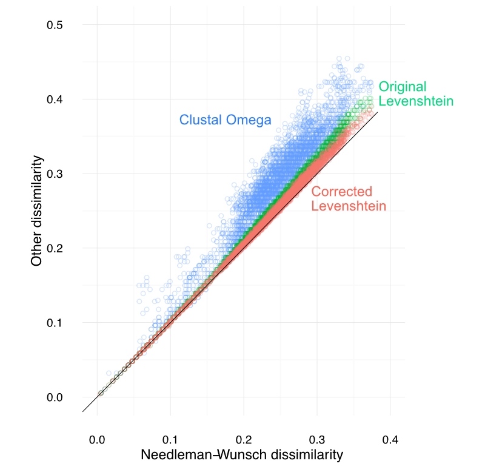

.. _genetic_section:

===========================
The genetic criterion
===========================

A critical piece of the dbOTU algorithm is determining which sequences
are sufficiently genetically dissimilar that they belong in different
OTUs regardless of their distribution across samples.

Review of previous approaches
=============================

Jukes-Cantor distance
---------------------

In dbOTU1, this genetic criterion was articulated
in terms of the ``makematrix`` output from
FastTree_.
First, the sequences were aligned to a common
16S alignment using PyNAST_. FastTree was then used to compute the
distances. As far as I can tell, FastTree simply computes the
Jukes-Cantor_ distance :math:`-\frac{3}{4} \log (1 - \frac{4d}{3})`,
where :math:`d` is the proportion of positions that differ (i.e., the
number of mismatches in the aligned sequences divided by the length of
the aligned sequences, ignoring gaps).

.. _Jukes-Cantor: https://en.wikipedia.org/wiki/Models_of_DNA_evolution#JC69_model_.28Jukes_and_Cantor.2C_1969.29.5B1.5D
.. _FastTree: http://www.microbesonline.org/fasttree/
.. _PyNAST: http://biocore.github.io/pynast/

In fact, the genetic criterion was evaluated using the
minimum of the aligned and unaligned Jukes-Cantor distances. This was a
weird hack: sometimes the alignment led to a greater
distance between two sequences than would be computed by just comparing
the unaligned sequences.

Hamming distance
----------------

In dbOTU2, the sequences were aligned with
PyNAST_, but the distances between the sequences were computed one at a
time to ease memory needs. Sequences were read one at a time from the
input fasta, and OTUs were stored in memory so that a sequence was only
compared to the OTUs to which it might potentially belong. In this
implementation, the dissimilarity between OTUs was just the proportion :math:`d`
of positions that differ (ignoring positions in which either or both
sequences had a gap).

Like in dbOTU1, the actual distance criterion was checked against the
minimum of the aligned and unaligned distances.

Evaluation of previous approaches
=================================

Aside from leading to occasionally confusing results, the alignment step
is moderately slow. Taking the minimum of two distances is an unpleasant
hack.

However, in general, the dissimilarities between sequences measured in different
ways are well-correlated. For example, it was not critical to use the
Jukes-Cantor distance rather than the simple Hamming distance.

This implementation
===================

New approach used in this implementation
----------------------------------------

This implementation uses the Levenshtein edit distance to measure the
dissimilarity between two sequences. A sequence is disqualified from
being merged into an OTU if

.. math::

   \frac{E}{\ell_\text{seq} + N_d}

is greater than some threshold, where :math:`E` is the Levenshtein
edit distance between the sequence and the OTU, :math:`\ell_\text{seq}`
is the length of the candidate sequence, and :math:`N_d` is
the number of deletion operations in the Levenshtein edit distance.

The rationale is that this metric reflects the sequence dissimilarity
between two aligned sequences. In that case, the number of mismatched
sites is the number of substitutions, insertions, and deletions (that
is, :math:`E`), and the number of total sites is the length of the
alignment (that is, :math:`\ell_\text{seq} + N_d`, or, equivalently,
:math:`\ell_\text{OTU} + N_i`, where :math:`i` is the number of insertions).

.. _genetic_caveat:

Caveat about the publication's genetic criterion
------------------------------------------------

In the publication, we define the Levenshtein metric with a denominator
:math:`\tfrac{1}{2}(\ell_\text{seq} + \ell_\text{OTU})`. For the reasons
described above, we believe this denominator was consistently smaller than
the correct one, so the Levenshtein-based dissimilarities reported in
the paper are higher than expected.

We also used alignments from Clustal Omega as our gold standard. Unfortunately,
we believe that Clustal Omega's alignments were not very good for these
purposes, and thus significantly overestimated the distance between sequences.
When using a more appropriate gold standard (a Needleman-Wunsch alignment with
a match score of 1, a mismatch penalty of 2, and a linear gap penalty of 2), it
becomes clear that the corrected Levenshtein edit distance only very minorly
overestimates the dissimilarity between sequences (see figure). We therefore
encourage dbOTU3 users to ignore some of the warnings made about the use of the
Levenshtein distance discussed in the paper.

.. _evaluating-genetic-section:

Evaluating a distance criterion
-------------------------------

The genetic distance threshold you choose is the dissimilarity above which a
sequence will not be merged into an OTU. For example, the default value
:math:`0.10` means that, if a sequence is 10% (or more) dissimilar from an
existing OTU, then that sequence will not end up in that OTU (even if their
distributions are perfectly identical).

Note that this is more like the "radius" than the "diameter" of the OTU's
member sequences: two sequences, each 10% (or less) dissimilar to the
representative sequence and thus up to 20% dissimilar to one another, can end
up in the same OTU.

I found that the dissmilarity metric shown above correlates with the dissimilarity computed
by a pairwise alignment just as well as the original implementation's
dissimilarity metric (i.e., the minimum of the aligned and unaligned
sequence dissimilarity).
It may be worth testing this relationship for your own data.
